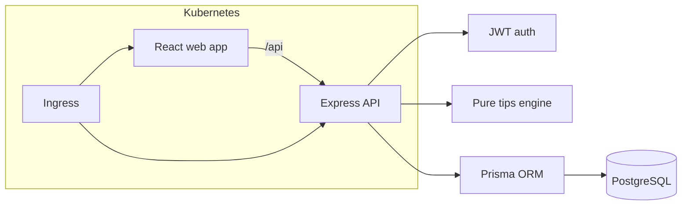

# PawPal — Pet Care & Wellness

PawPal is a deliberately small, full-stack application for keeping a pet's everyday health information in one friendly place. Owners can record pets, wellness observations, vaccinations, and see reminders and practical, rule-based tips.

## Features

- Secure email registration and JWT login
- Pet profiles with photo, breed, birthday, and current weight
- Weight and activity history with an interactive trend chart
- Vaccination due dates and upcoming/overdue reminders
- Simple, transparent wellness tips for weight, activity, and vaccinations
- Responsive, keyboard-friendly React UI with useful empty/error/loading states
- Production-ready containers, Kubernetes/Helm packaging, and CI/CD examples

## Architecture



## Quick start

Requirements: Docker with Compose, or Node.js 20 and PostgreSQL 15+.

```bash
cp server/.env.example server/.env
cp web/.env.example web/.env
docker compose up --build
```

Open <http://localhost:5173>. The API is at <http://localhost:3000/api> and the health check is `/api/health`. Compose applies migrations and seeds a demo account (`demo@pawpal.local` / `PawPal123!`) once. Change all example credentials outside local development.

For a host-based setup:

```bash
npm install --prefix server && npm install --prefix web
docker compose up -d postgres
npm --prefix server run prisma:migrate
npm --prefix server run seed
make dev
```

## API

All routes except health and auth require an `Authorization` header containing the login JWT.

| Method | Route | Purpose |
|---|---|---|
| GET | `/api/health` | Liveness/readiness status |
| POST | `/api/auth/register` | Create an owner account |
| POST | `/api/auth/login` | Obtain a JWT |
| GET, POST | `/api/pets` | List or create pets |
| GET, PATCH, DELETE | `/api/pets/:id` | Read, update, or remove a pet |
| GET, POST | `/api/pets/:id/wellness` | List or add wellness entries |
| GET, POST | `/api/pets/:id/vaccinations` | List or add vaccinations |
| PATCH, DELETE | `/api/pets/:id/vaccinations/:vaccinationId` | Update or remove a vaccination |
| GET, POST | `/api/pets/:id/vet-visits` | List or schedule vet visits |
| PATCH | `/api/pets/:id/vet-visits/:visitId` | Update a vet visit |
| GET | `/api/reminders` | Upcoming and overdue care items |
| GET | `/api/tips/:petId` | Explainable wellness tips |

## Common commands

`make dev`, `make test`, `make lint`, `make build`, and `make seed` operate both packages where applicable. See [CONTRIBUTING.md](CONTRIBUTING.md) for the development workflow.

## Deployment

- Production images: `server/Dockerfile` and `web/Dockerfile`
- Local stack: `docker-compose.yml`
- Helm chart: `charts/pawpal` (optional bundled PostgreSQL or external database)
- Standalone namespace/config examples: `k8s`
- CI, image publication/security scanning, chart verification, CodeQL, and gated deployment: `.github/workflows`

## Screenshots

> Screenshot placeholder — run the app and add a dashboard capture here.

PawPal provides informational prompts, not veterinary diagnosis. Consult a veterinarian for health concerns.
